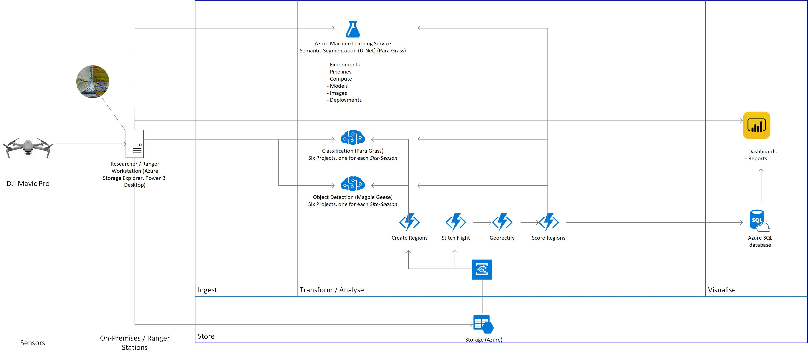

# Healthy Country AI

### Overview
The Healthy Country project in Kakadu is a collaboration between Bininj co-researchers and Indigenous rangers, [Kakadu Board of Management](https://www.directory.gov.au/portfolios/environment-and-energy/director-national-parks/kakadu-board-management), [CSIRO](https://www.csiro.au/), [Parks Australia](https://parksaustralia.gov.au/), [Northern Australia National Environment Science Program (NESP)](https://www.nespnorthern.edu.au/), [University of Western Australia (UWA)](https://www.uwa.edu.au/), [Charles Darwin University (CDU)](https://www.cdu.edu.au/) and [Microsoft](https://www.microsoft.com/en-us/ai/ai-for-earth) to support better decision-making to care for significant species and habitats on Indigenous lands.

The Healthy Habitat AI project consists of three models developed using CustomVision.ai and Azure Machine Learning Service, using RGB images, collected by rangers using an off the shelf affordable drone, DJI Mavic PRO 2, from sites in Kakadu National Park, Australia. The models allow rangers to regularly survey large areas that are difficult to access by converting large volumes of data (1000s of high res photos) into metrics that demonstrate how the identified key values are changing following selected management methods. The Healthy Habitat AI project represents an end to end solution to support adaptive management with clearly defined success metrics.

The models consist of -

CustomVision.ai:
* Para grass - Classification (304 x 228 px Tiles)
* Magpie Geese - Object Detection (304 x 228 px Tiles)

Azure Machine Learning Service:
* Para grass - Semantic Segmentation (U-Net)

# Data Preparation



The rangers and traditional owners, Bininj, selected several sites based on important environmental and cultural values. At each of these sites, a fixed set of transects are programmed into the drone to cover the same area of interest at the same height (60m above from point of take off) each time the area is flown. The drone flys at a set speed and sets capture rate for photos to get a 60% overlap in photos to allow photogramtic stitching. The three areas are flat flood plains so the height remains constant above the survey area. Once the transects are flown the rangers return to home base where they have internet and computers. The Micro-SD card is removed from the drone and inserted into the rangers pc.

Rangers seperate the photos into folders for each site and if multiple surveys have been flown at a site into site/date folders. An application is installed on the rangers pc or field laptop, opened through a short cut executable on the desktop. This application depicts the six seasons defined by environmental indicators that mark changes to the season. Rangers select the files from the site folders they created and drag the files into the appropriate season on the app. The app prompts the ranger to select a site from a list and then prompts to select the type of photographs, animal or habitat. Once the site and type are selected the app automatically synchronizes the data to Azure Storage and creates a standardised file structure for each site, site-season-type-datetime.


One storage account is used and sub folders are created to differentiate the different sites, seasons, survey times, model types. Files are stored as blobs. For example the structure,
Storage
* healthyhabitatai
Site-season
* ubir-wurrkeng
Model type
* animal
* datetime (of survey)
* files
* habitat
* datetime of survey
* files

Data is automatically divided into containers named using the combination of *site* and *season* matching the section of the seasonal wheel images were dragged onto, for example -

* cannon-hill-kunumeleng
* cannon-hill-wurrkeng
* jabiru-dreaming-kunumeleng
* jabiru-dreaming-wurrkeng
* ubir-kunumeleng
* ubir-wurrkeng

Then by the YYY-MM-DD-HHMM the collection occured, for example -
* 2019-04-03-1050

Two functions are triggered by the successful upload of each photo.

Function 1. Split regions
The first function splits each photograph into 120 tiles and uploads the tiled images to seasonal projects in custom vision.au for labeling. If a project doesn’t exist, a new customvision.ai project is automatically created using the site-season-type combination described above. End users can then open customvision.ai and label animals (object detection) or habitat(classification) to train the model. As more labels are accumulated for each model users should train the model and publish the new results to improve accuracy.

Function 2. Score regions.
The second function has three elements.
Firstly it resizes the high resolution images (15-20mb) and saves a smaller (~1mb) version of the photo with the same name to support quicker rendering on the powerBI dashboard.

The function then uses the available models in customvision.ai to score each tile for dominant habitat type (classification) and animal (object detection). The scores are written out to an SQL database with associated covariates that allow subsequent filtering and analytics in Power BI. In this system a link to a SAS URL for each image is written to the database to provide a direct link back to the photographs using survey date as the key.

# AI/ML models
Here we have implemented three models, classification, object detection (using customvision.ai) and semantic segmentation (Azure Machine Learning Services).


# customvision.ai models

### Habitat
For the habitat model We scored the dominant habitat type for each tile (add size) by season and site. We greatly reduced the complexity of the labelling task by limiting the labels to broad habitat types, with more detail provided for our target species, para grass, including a “dead para grass” label which directly relates to the management goals of the rangers and traditional owners. We chose to label 8 broad habitat categories;

* Para grass
* Water
* Dense Para-grass
* Dead Para-grass
* Bare ground
* Other grass
* Lily
* Tree

We use a single tag per image using a classification model. This required subject matter experts, in this case researchers who had a good knowledge of the visual characteristics of para grass compared with other native species from aerial photos. Using this method it was necessary make decisions about which habitat type was dominant reducing the complexity of the labelling task but also reducing the detail of the results and leading to difficult labelling decisions in tiles that had diverse habait characteristic, e.g equal parts water, bare ground and paragrass.

### Animal
For the habitat model subject matter experts (researchers with deep knowledge of vertebrate species in the region) labeled all vertebrate species that were easily identified in the tiles. The focus species, magpie geese, was easily separated from other species so there was a very high confidence in these labels. Other species, such as egrets and spoon bills, were less distinct (from 60m) and were lumped into one category, egrets, which included all white birds. Several other species had very few individuals (<15 labels) and these were excluded. Labels were dominated by magpie geese and egrets, the remaining species were very low. Species labels include:

* Goose
* Egret
* Crocodile
* Stork
* Kite
* Darter


### Machine Learning Workstation
* Install [Azure Storage Explorer](https://azure.microsoft.com/en-us/features/storage-explorer/)
* Install [Power BI Desktop](https://powerbi.microsoft.com/en-us/desktop/)
* Install [Anaconda](https://docs.anaconda.com/anaconda/install/)
* Clone `https://github.com/svanbodegraven/HealthyHabitatAI.git`
* `cd HealthyHabitatAI`
* Configure a [local development environment](https://docs.microsoft.com/en-us/azure/machine-learning/service/how-to-configure-environment#local)

```
conda env create -f environment.yml
conda activate HealthyHabitatAI
conda install notebook ipykernel
ipython kernel install --user
```

### Field  Local Workstation
* Install [Azure Storage Explorer](https://azure.microsoft.com/en-us/features/storage-explorer/)
* Install [Power BI Desktop](https://powerbi.microsoft.com/en-us/desktop/)


# Contributing
This project welcomes contributions and suggestions. Most contributions require you to agree to a Contributor License Agreement (CLA) declaring that you have the right to, and actually do, grant us the rights to use your contribution. For details, visit [cla.microsoft.com](https://cla.opensource.microsoft.com/).

When you submit a pull request, a CLA-bot will automatically determine whether you need to provide a CLA and decorate the PR appropriately (e.g., label, comment). Simply follow the instructions provided by the bot. You will only need to do this once across all repos using our CLA.

This project has adopted the [Microsoft Open Source Code of Conduct](https://opensource.microsoft.com/codeofconduct/). For more information see the [Code of Conduct FAQ](https://opensource.microsoft.com/codeofconduct/faq/) or contact [opencode@microsoft.com](mailto:opencode@microsoft.com) with any additional questions or comments.

# License
This repository is licensed with the [MIT license](https://github.com/Microsoft/dotnet/blob/master/LICENSE).
