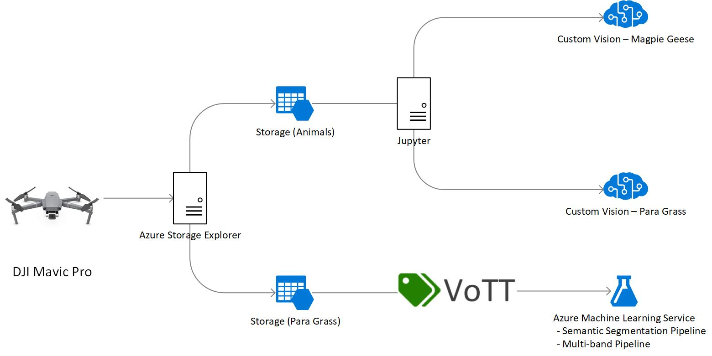
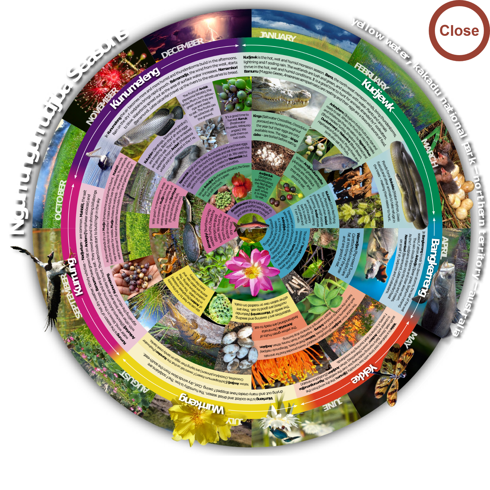

# Healthy Country AI

### Overview
The Healthy Country project in Kakadu is a collaboration between Bininj co-researchers and Indigenous rangers, Kakadu Board of Management, CSIRO, Parks Australia, Northern Australia National Environment Science Program (NESP), University of Western Australia (UWA) and Charles Darwin University (CDU) and Microsoft to support better decision-making to care for significant species and habitats on Indigenous lands.

The Healthy Habitat AI project consists of four models developed using CustomVision.ai and Azure Machine Learning Service, using images and multi-spectral data, collected by rangers using DJI Mavic 2s, from sites in Kakadu National Park. The models increase the area a ranger is able to assess, by converting large volumes of data into metrics significant to the health of the land.

The models consist of -

CustomVision.ai:
* Para grass - Classification (304 x 228 px Tiles)
* Magpie Geese - Object Detection (304 x 228 px Tiles)

Azure Machine Learning Service:
* Para grass - Semantic Segmentation (U-Net)
* Para grass - Multi-spectral (5-bands) (U-Net)

### Data Preparation



After connecting a DJI Mavic Pro to a Microsoft Surface, images are dragged onto the section of a seasonal wheel matching the *site* the data was collected at and the *season* the data was collected during, which automatically synchronizes the data to Azure Storage.



Storage consists of two accounts for data collection -
* Healthy Habitat Animals (healthyhabitatanimals), and
* Healthy Habitat Para grass (healthyhabitatparragrass)

Each account uses Blobs only.

Data is automatically divided into containers named using the combination of *site* and *season* matching the section of the seasonal wheel images were dragged onto, for example -

* cannon-hill-kunumeleng
* cannon-hill-wurrkeng
* jabiru-dreaming-kunumeleng
* jabiru-dreaming-wurrkeng
* ubir-kunumeleng
* ubir-wurrkeng

Then by the YYY-MM-DD-HHMM the collection occured, for example -
* 2019-04-03-1050

...

Classes -
* Para grass
* Burnt Para-grass
* Dense Para-grass
* Dead Para-grass
* Wet Para-grass
* Tree
* Water

### Machine Learning Workstation
* Install [Azure Storage Explorer](https://azure.microsoft.com/en-us/features/storage-explorer/)
* Install [Power BI Desktop](https://powerbi.microsoft.com/en-us/desktop/)
* Install [Anaconda](https://docs.anaconda.com/anaconda/install/)
* Clone `https://github.com/svanbodegraven/HealthyHabitatAI.git`
* `cd HealthyHabitatAI`
* Configure a [local development environment](https://docs.microsoft.com/en-us/azure/machine-learning/service/how-to-configure-environment#local)

```
conda env create -f environment.yml
conda activate HealthyHabitatAI
conda install notebook ipykernel
ipython kernel install --user
```

### Field  Local Workstation
* Install [Azure Storage Explorer](https://azure.microsoft.com/en-us/features/storage-explorer/)
* Install [Power BI Desktop](https://powerbi.microsoft.com/en-us/desktop/)
