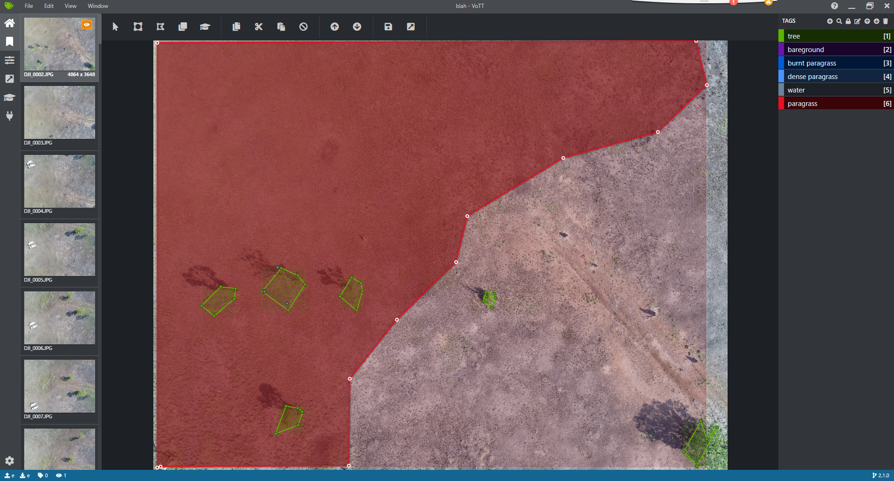
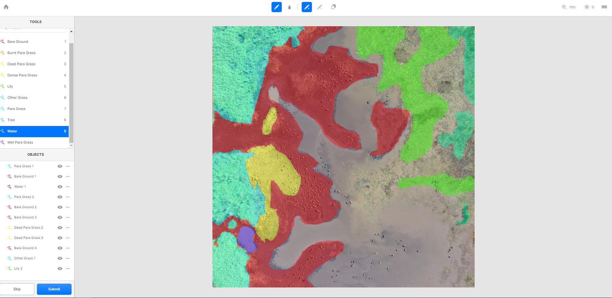

 ## Healthy Country AI

### Overview
The Healthy Country AI project in Kakadu NP is a collaboration between Bininj co-researchers and Indigenous rangers, [Kakadu Board of Management](https://www.directory.gov.au/portfolios/environment-and-energy/director-national-parks/kakadu-board-management), [CSIRO](https://www.csiro.au/), [Parks Australia](https://parksaustralia.gov.au/), [Northern Australia National Environment Science Program (NESP)](https://www.nespnorthern.edu.au/), [University of Western Australia (UWA)](https://www.uwa.edu.au/), [Charles Darwin University (CDU)](https://www.cdu.edu.au/) and [Microsoft](https://www.microsoft.com/en-us/ai/ai-for-earth) to support better decision-making to care for significant species and habitats on Indigenous lands.

The Healthy Country AI project consists of three models developed using CustomVision.ai and Azure Machine Learning Service, using RGB images, collected by rangers using an off the shelf affordable drone, DJI Mavic Pro 2, from sites in Kakadu National Park, Australia. The models allow rangers to regularly survey large areas that are difficult to access by converting large volumes of data (1000s of high res photos) into metrics that demonstrate how the identified key values are changing following selected management methods. The Healthy Country AI project represents an end to end solution to support adaptive management with clearly defined success metrics.
The models consist of -

CustomVision.ai:
* Para grass - Classification (304 x 228 px Tiles)
* Magpie Geese - Object Detection (304 x 228 px Tiles)

Azure Machine Learning Service:
* Para grass - Semantic Segmentation (U-Net)


## Responsible AI, ethical data governance
The AI which interprets the drone-collected data has been built with the advice and guidance of the Traditional Owners in regard to what is important to them from a land management perspective. 
That could be information about the presence or absence of animals. It could be information about the condition of different types of grasses or trees. That then feeds into the AI models developed to interpret the data.
The results and analysis are delivered to rangers via a Power BI dashboard that was designed in partnership with the Traditional Owners based on their cultural values and the season. Rangers can use the dashboard to support their decision making regardless of where they are based.
The solution has been constructed with several layers of privacy as some of the sites where the drones collect data are sites sacred to the Traditional Owners, and as such, imagery and data from those sites needs to be properly protected.
The platform features three rings of data management and data governance. The innermost data ring is restricted to Traditional Owners, rangers and Indigenous elders who identify which data can be made available to the second ring.
The data in the second ring can be accessed by researchers and collaboration partners. The outermost ring is data that can be made available to the public.

# Data Preparation

The rangers and traditional owners, Bininj, selected several sites based on important environmental and cultural values. At each of these sites, a fixed set of transects are programmed into the drone to cover the same area of interest at the same height (60m above from point of take off) each time the area is flown. The drone flys at a set speed and sets capture rate for photos to get a 60% overlap in photos to allow photogrammetric analysis. The three areas are flat flood plains so the height remains constant above the survey area. Once the transects are flown the rangers return to home base where they have internet and computers. The Micro-SD card is removed from the drone and inserted into the rangers pc.

Rangers seperate the photos into folders for each site and if multiple surveys have been flown at a site into site/date folders. An application (https://github.com/microsoft/HealthyCountryAI/tree/master/app/Release) is installed on the rangers pc or field laptop, opened through a short cut executable on the desktop. This application depicts the six seasons defined by environmental indicators that mark changes to the season. Rangers select the files from the site folders they created and drag the files into the season that Bininj Traditional Owners use to monitor and manage this area on the app. The app prompts the ranger to select a site from a list and then prompts to select the type of photographs, animal or habitat. Once the site and type are selected the app automatically synchronizes the data to Azure Storage and creates a standardised file structure for each site, site-season-type-datetime.


One storage account is used and sub folders are created to differentiate the different sites, seasons, survey times, model types. Files are stored as blobs. For example;
Storage
* healthyhabitatai
Site-season
* ubir-wurrkeng
Model type
* animal
* datetime (of survey)
* files
* habitat
* datetime of survey
* files

Data is automatically divided into containers named using the combination of *site* and *season* matching the section of the seasonal wheel images were dragged onto, for example -

* cannon-hill-kunumeleng
* cannon-hill-wurrkeng
* jabiru-dreaming-kunumeleng
* jabiru-dreaming-wurrkeng
* ubir-kunumeleng
* ubir-wurrkeng

Then by the YYY-MM-DD-HHMM the collection occured, for example -
* 2019-04-03-1050

Two functions are triggered by the successful upload of each photo.

Function 1. Split regions
The first function splits each photograph into 120 tiles and uploads the tiled images to seasonal projects in custom vision.au for labeling. If a project doesn’t exist, a new customvision.ai project is automatically created using the site-season-type combination described above. End users can then open customvision.ai and label animals (object detection) or habitat(classification) to train the model. As more labels are accumulated for each model users should train the model and publish the new results to improve accuracy.

Function 2. Score regions.
The second function has three elements.
Firstly it resizes the high resolution images (5472x3648) and saves a smaller (1024x768) version of the photo with the same name to support quicker rendering on the powerBI dashboard.

The function then uses the available models in customvision.ai to score each tile for dominant habitat type (classification) and animal (object detection). The scores are written out to an SQL database with associated covariates that allow subsequent filtering and analytics in Power BI. In this system a link to a SAS URL for each image is written to the database to provide a direct link back to the photographs using survey date as the key.

# AI/ML models
Here we have implemented three models, classification, object detection (using customvision.ai) and semantic segmentation (Azure Machine Learning Services).  This approach requires users to train models by identifying objects in the photos through labelling features of interest. It is important to note that there is no fixed number of labels required to train the models.  In this project we found that once 2000 images were labelled the accuracy of the models (the ability of the model to accuractely predict habitat type and animals) greatly increased and the labelling task become faster and easier.  In customvision.ai once you have completed the initial labelling task the models are trained allowing predictions to be displayed on the untagged images.  The user can then confirm or reject the predicted label and add any missed features.   

# CustomVision.ai models

### Habitat
For the habitat model, we scored the dominant habitat type for each tile by season and site. We greatly reduced the complexity of the labelling task by limiting the labels to broad habitat types, with more detail provided for our target species, para grass, including a “dead para grass” label which directly relates to the management goals of the rangers and Traditional Owners. We chose to label 8 broad habitat categories;

* Para grass
* Water
* Dense Para-grass
* Dead Para-grass
* Bare ground
* Other grass
* Lily
* Tree

We use a single tag per image using a classification model. This required subject matter experts, in this case researchers who had a good knowledge of the visual characteristics of para grass compared with other native species from aerial photos. Using this method it was necessary make decisions about which habitat type was dominant, reducing the complexity of the labelling task but also reducing the detail of the results and leading to difficult labelling decisions in tiles that had diverse habait characteristic, e.g equal parts water, bare ground and paragrass.

### Animal
For the habitat model subject matter experts (researchers with deep knowledge of vertebrate species in the region) labeled all vertebrate species that were easily identified in the tiles. The focus species, magpie geese, was easily separated from other species so there was a very high confidence in these labels. Other species, such as egrets and spoon bills, were less distinct (from 60m) and were lumped into one category, egrets, which included all white birds. Several other species had very few individuals (<15 labels) and these were excluded. Labels were dominated by magpie geese and egrets, the remaining species were sparse. Species labels include:

* Goose
* Egret
* Crocodile
* Stork
* Darter (<15 labels)
* kite (<15 labels)

#  How to Label Data

Semantic segmentation requires categories to be outlined using polygons for each category visbile in a image.  For this project we trialled two labelling tools, VOTT and LabelBox. 

### VOTT user experience.
Training data (aerial photographs of the study area) can be accessed locally through creating a connection to files stored on a PC or through a cloud connection to online storage.  
In this project we created a project linked to Azure blob storage containers requiring a SAS token to be generated.  

The labelling experience in VOTT is not well suited to labelling heterogenous natural systems characterised by complex overlapping features.  This system is better suited to labelling well defined categorical data such as buildings, cars and signs.  In natural systems there are gradual changes between habitat features and significant heterogeneity within categories.  For example, a common labelling experience involved categorising a continous ground layer of dense para grass (label 1) interspersed with trees and shrubs (category 2), other grass (category 3) growing through some areas dominated by para grass(category 4) with small depressions holding water (category 5) and other large sections of open water some of which had varying denisty of emergent vegetation (all lumped into category 5) or predominantly water lily (category 6).  In this context, VOTT does not allow overlapping regions meaning that smaller sections need to be labelled and joined with basic vector tools (vertices or rectangular polygons).  If there are any overlapping regions the labels cannot be saved, and the entire label needs to be removed.  VOTT will not allow any progression until all the regions are tagged which is very difficult to achieve in this use case.  This method requires a substantial number of labels for each category, so the labelling experience and tools are very important to support rapid and accurate labelling.  Due to the limitations for this use case listed above we did not use this tool for labelling. 

# VOTT interface showing overlapping labels that will cause an error.  




### LabelBox labelling experience. 
LabelBox is linked directly to the Azure Blob storage containers using a SAS token.  

The labelling experience is much quicker and more intuative using LabelBox.  Polygons are created by either holding down the left mouse button and tracing around the habitat using a drawing feature or selecting features through continous clicking to new vertices.  This tooling provides a more intuitive user experience allowing the user to chose coarse or fine methods depending on the feature that is being labelled.  

Despite the more user friendly labelling tools, it is still difficult to categorise complex habitat features that are of a more continuous nature.  Some habitat types are heterogenous so the user needs to make a choice as to what the dominant category is, understanding that sometimes there is not a clear category.  There are also many small habitat features, such as waterholes surround by other categories, that are time consuming to mask.  The labelling experience is easiest when there are distinct separated features such as open water, bare ground or a dense monoculture of para grass.  When there are largely homogenous separated habitat types the quickest way to label the image is to label the least dominant categories using the polygon tool and then use the paint tool to label the remaining parts of the image.  This ensures that edges between categories are completely labelled and discrete.  It is important to ensure that the barriers between habitat categories are closed before using the paint tool otherwise any connected space will be filled with the selected category.  
A useful feature in LabelBox is that the user can zoom in to an area and partially enclose a particular category and then add to the polygon by using overlapping polygons. This allows more detailed labelling to occur.   Using this method it is also possible to enclose the edges of a category, label other categories within the enclosed area and then use the fill tool to easily label the dominant category.  

# Example of LabelBox with overlapping habitat types and the remaining category (water) can be easily labelled with the fill tool (paint drop icon)



# Developing categories
The main challenge using this approach is to decide how many categories to label.  To develop an accurate model, each category requires many labels (thousands).  Therefore, if you try to be too specific with the categories (e.g 10 categories to describe the different growth states of para grass) you will need to multiply the number of labels required by the number of categories you created. For example, if you are aiming for a minimum of 2000 labels for each category, 5 categories will require 10000 labels and if you increase the number of categories to 20 you will require 40000 labels requiring a significant commitment.  Conversely, if you select more general and inclusive labels (e.g lump all types of grass into an all grasses label) then you will require less labels but your model will not be very specific.  

# Machine Learning Service models
Two options are provided:
* A [fastai Jupyter notebook](./notebooks/ubir-wurrkeng-fastai.ipynb), and
* An [ML Pipeline](./notebooks/qubvel-segmentation_models-U-Net-ML-Pipeline.ipynb), implementing https://github.com/qubvel/segmentation_models

Both the fast.ai Jupyter notebook and the ML Pipeline use data prepared with the Data Preparation notebook and [Labelbox](https://labelbox.com).

### Machine Learning Workstation
* Install [Azure Storage Explorer](https://azure.microsoft.com/en-us/features/storage-explorer/)
* Install [Power BI Desktop](https://powerbi.microsoft.com/en-us/desktop/)
* Install [Anaconda](https://docs.anaconda.com/anaconda/install/)
* Clone `https://github.com/svanbodegraven/HealthyHabitatAI.git`
* `cd HealthyHabitatAI`
* Configure a [local development environment](https://docs.microsoft.com/en-us/azure/machine-learning/service/how-to-configure-environment#local)

```
conda env create -f environment.yml
conda activate HealthyHabitatAI
conda install notebook ipykernel
ipython kernel install --user
```

# Data visualisation and interaction
The scored data is stored in an SQL database which is linked to a power BI report.  The SQL server contains links to the resized photographs and for each photograph the scored results of the customvision.ai models (% of each habitat type and count of each animal).  


### Field  Local Workstation
* Install [Azure Storage Explorer](https://azure.microsoft.com/en-us/features/storage-explorer/)
* Install [Power BI Desktop](https://powerbi.microsoft.com/en-us/desktop/)

# Contributing
This project welcomes contributions and suggestions. Most contributions require you to agree to a Contributor License Agreement (CLA) declaring that you have the right to, and actually do, grant us the rights to use your contribution. For details, visit [cla.microsoft.com](https://cla.opensource.microsoft.com/).

When you submit a pull request, a CLA-bot will automatically determine whether you need to provide a CLA and decorate the PR appropriately (e.g., label, comment). Simply follow the instructions provided by the bot. You will only need to do this once across all repos using our CLA.

This project has adopted the [Microsoft Open Source Code of Conduct](https://opensource.microsoft.com/codeofconduct/). For more information see the [Code of Conduct FAQ](https://opensource.microsoft.com/codeofconduct/faq/) or contact [opencode@microsoft.com](mailto:opencode@microsoft.com) with any additional questions or comments.

# Contact
For more details or help deploying, contact:
* [Tianji Dickens](Tianji.Dickens@microsoft.com), Microsoft
* [Dr Justin Perry]( Justin.perry@csiro.au), CSIRO, or
* [Steve van Bodegraven](Steve.VanBodegraven@microsoft.com), Microsoft

# License
This repository is licensed with the [MIT license](https://github.com/Microsoft/dotnet/blob/master/LICENSE).
